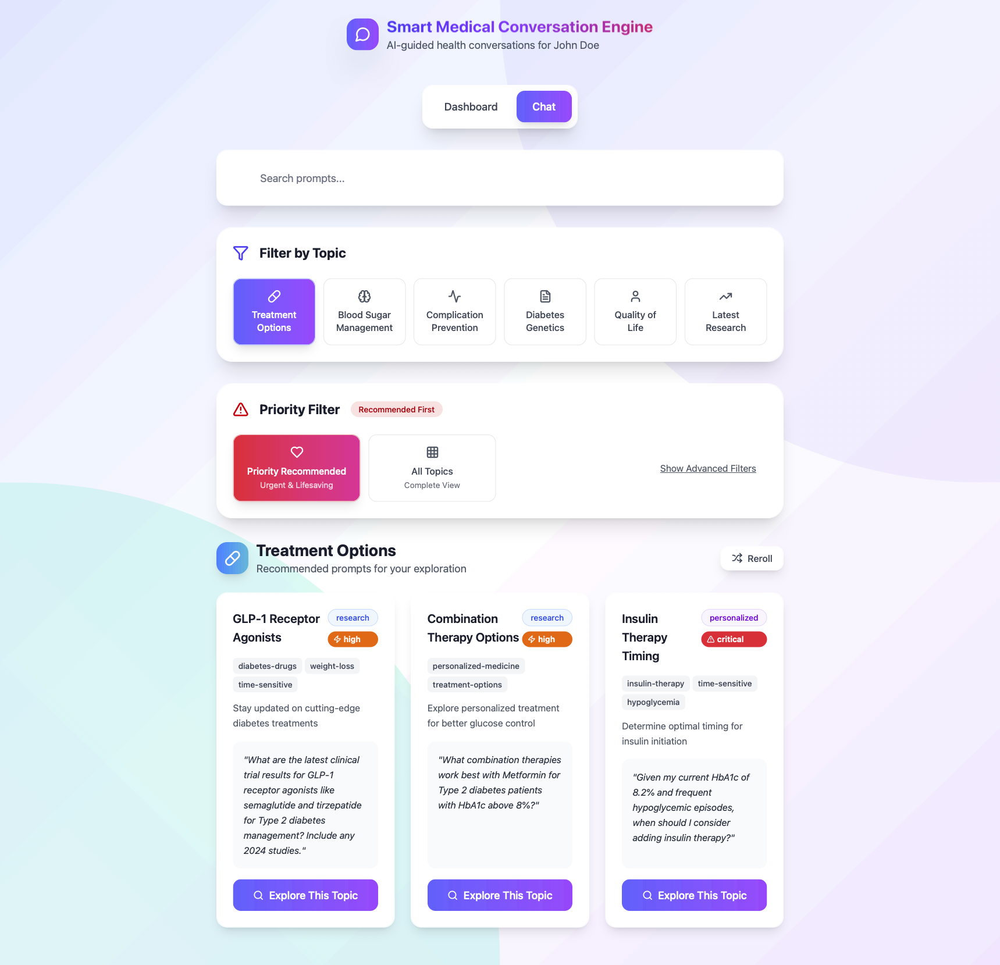

# 🩺 Diabetes AI Conversation Optimizer Engine
(docs generated by ai, happy to talk about in depth!)

<br>
An intelligent medical AI system designed specifically for Type 2 diabetes patients, providing evidence-based information, personalized treatment guidance, and comprehensive diabetes management support.

## 📱 Live Interface Preview



*Interactive diabetes management interface with AI-powered treatment recommendations and priority filtering*

## 🌟 Features

### 🤖 **Advanced AI Integration**
- **Perplexity AI**: Real-time medical source gathering and research
- **OpenAI GPT-4**: Comprehensive medical response generation
- **Dual AI Pipeline**: Ensures evidence-based, up-to-date information

### 💊 **Diabetes-Focused Content**
- **Treatment Options**: GLP-1 agonists, combination therapies, insulin timing
- **Blood Sugar Management**: Hypoglycemia prevention, HbA1c optimization
- **Complication Prevention**: Neuropathy, kidney protection, eye care
- **Diabetes Genetics**: Risk factors, family screening, pharmacogenomics
- **Quality of Life**: Mental health, work-life balance, travel considerations
- **Latest Research**: 2024 breakthroughs, clinical trials, AI in diabetes care

### 🎯 **Smart Response System**
- **Priority Filtering**: Critical, high, moderate, low priority prompts
- **Response Modification**: Simplify, add detail, or personalize responses
- **Guided Prompts**: 60+ pre-crafted diabetes-specific questions
- **Follow-up Suggestions**: Intelligent conversation continuations

### 👤 **Patient-Centered Design**
- **John Doe Profile**: 45-year-old with Type 2 diabetes, hypertension, neuropathy
- **Real Scenarios**: HbA1c 8.2%, hypoglycemic episodes, upcoming appointments
- **Personalized Context**: All responses tailored to patient's specific situation

## 🏗️ **Architecture**

### **Backend (FastAPI)**
```
├── Medical AI Engine
│   ├── Perplexity Integration (Medical Sources)
│   ├── OpenAI GPT-4 (Response Generation)
│   └── Response Modification System
├── API Endpoints
│   ├── /api/medical/ask (Primary endpoint)
│   ├── /api/medical/modify (Response modification)
│   └── /api/health (System health check)
└── Patient Context Management
```

### **Frontend (React)**
```
├── Guided Conversation Interface
│   ├── Topic-based prompt organization
│   ├── Priority filtering system
│   └── Response interaction tools
├── Medical Response Display
│   ├── Evidence quality indicators
│   ├── Confidence level badges
│   └── Source citations
└── Patient Data Integration
```

## 🚀 **Quick Start**

### **Prerequisites**
- Python 3.9+
- Node.js 16+
- OpenAI API Key
- Perplexity API Key

### **Backend Setup**
```bash
cd backend
python -m venv venv
source venv/bin/activate  # On Windows: venv\Scripts\activate
pip install -r requirements.txt

# Create .env file
echo "OPENAI_API_KEY=your_openai_key_here" > .env
echo "PERPLEXITY_API_KEY=your_perplexity_key_here" >> .env

# Start server
python main.py
```

### **Frontend Setup**
```bash
cd frontend
npm install
npm run dev
```

### **Access Application**
- Frontend: http://localhost:5173
- Backend API: http://localhost:8000
- API Documentation: http://localhost:8000/docs

## 🎯 **Usage Examples**

### **Treatment Questions**
- "What are the latest GLP-1 receptor agonist options for my HbA1c level?"
- "Should I consider adding insulin with my current hypoglycemic episodes?"
- "How do SGLT-2 inhibitors help with cardiovascular protection?"

### **Blood Sugar Management**
- "What strategies can prevent my frequent hypoglycemic episodes?"
- "How can I safely lower my HbA1c from 8.2% to target range?"
- "What emergency supplies should I have for severe hypoglycemia?"

### **Complication Prevention**
- "How can I manage my diabetic neuropathy symptoms?"
- "What kidney protection strategies work with my current eGFR?"
- "What should I expect at my upcoming diabetic eye exam?"

## 🛠️ **Configuration**

### **Environment Variables**
```bash
OPENAI_API_KEY=sk-...          # Required: OpenAI API access
PERPLEXITY_API_KEY=pplx-...    # Required: Perplexity API access
```

### **Patient Context**
The system is pre-configured for John Doe's diabetes profile:
- Age: 45
- Conditions: Type 2 Diabetes, Hypertension, Neuropathy
- Medications: Metformin, Lisinopril, Atorvastatin
- Recent Labs: HbA1c 8.2%, eGFR 78 mL/min

## 📊 **API Reference**

### **Primary Endpoints**

#### `POST /api/medical/ask`
Generate diabetes-focused medical response
```json
{
  "question": "How can I prevent hypoglycemic episodes?",
  "patient_context": {
    "age": 45,
    "conditions": "Type 2 Diabetes, Hypertension"
  }
}
```

#### `POST /api/medical/modify`
Modify existing response (simplify/detail/personalize)
```json
{
  "response_id": "uuid",
  "modification_type": "simplify",
  "patient_context": {...}
}
```

## 🔬 **Technology Stack**

### **Backend**
- **FastAPI**: High-performance Python web framework
- **OpenAI GPT-4**: Advanced language model for medical responses
- **Perplexity AI**: Real-time medical research and sourcing
- **Pydantic**: Data validation and settings management
- **HTTPX**: Async HTTP client for API integrations

### **Frontend**
- **React 18**: Modern UI framework
- **Vite**: Fast build tool and dev server
- **Tailwind CSS**: Utility-first CSS framework
- **Lucide React**: Beautiful icon library
- **React Router**: Client-side routing

## 🏥 **Medical Disclaimer**

This AI system is designed for **educational purposes only** and should not replace professional medical advice, diagnosis, or treatment. Always consult with healthcare professionals for medical decisions.

## 📝 **License**

MIT License - see LICENSE file for details

## 🤝 **Contributing**

1. Fork the repository
2. Create feature branch (`git checkout -b feature/diabetes-enhancement`)
3. Commit changes (`git commit -m 'Add new diabetes management feature'`)
4. Push to branch (`git push origin feature/diabetes-enhancement`)
5. Open Pull Request

## 📞 **Support**

For questions about diabetes management features or technical issues:
- 📧 Email: [Your Email]
- 🐛 Issues: [GitHub Issues URL]
- 📖 Documentation: [Documentation URL]

---

**Built with ❤️ for diabetes patients and healthcare providers** 
